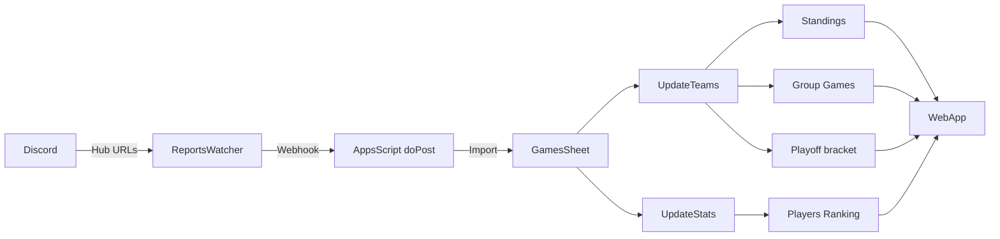
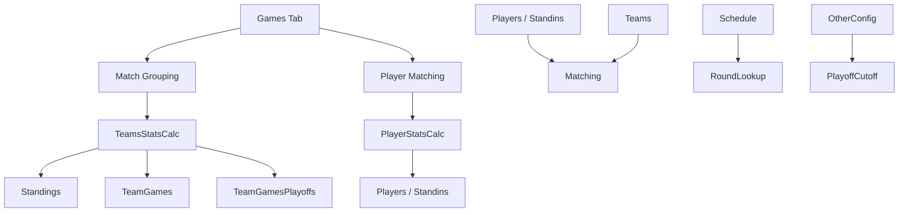

# 🏆 QuakeWorld Tournament Management (Google Sheets–Driven)

This project provides a **Google Sheets–based backend** for managing QuakeWorld tournaments, including:

- Automatic game imports from the QuakeWorld Hub
- Group-stage standings calculation
- Playoff separation
- Discord integration
- API-backed Web frontend

Google Sheets acts as the **single source of truth**, with Apps Script providing the backend logic.

---

## How to use this (for beginners)

### Requirements

The only requirements are:
- a Google account
- a bit of focus and patience 😀
  
### Initial setup

Log in to your Google account, then create your own instance of the QuakeWorld Tournament Management Google Sheet for the tournament you want to manage by navigating here
  👉 https://docs.google.com/spreadsheets/d/1F0J3vrX2EySzALGfVQrfzDOqyT_wiDtY61LnWe_BAWE/copy

and clicking `Make a copy`. Rename the Sheet to clearly identify your tournament.

Populate the following tabs as the miniumum viable setup:

- **Players**
- **Teams**
- **Schedule**
- **ScheduleConfig**
- **OtherConfig**
- **Discord**

#### Tabs and their purpose

| Tab | Purpose | Additional info |
|---|---|---|
| **Players / Standins** | List of players and their stats | `Game Nicks` is a comma-separated list of in-game `/name`(s) used to match a game record to a player. `Player` column is used for display-only purposes |
| **Teams** | List of teams | `Team Tag` must match the in-game `/team`. `Team Name` must match Schedule `Team1`/ `Team2` |
| **Standings** | Group-stage standings | **DO NOT EDIT** – generated automatically |
| **DataImport** | Import queue / manual import functionality  | Only edit yellow rows if manually importing |
| **UnmatchedPlayers** | Unmatched game nicks | Diagnostic tab – **DO NOT EDIT** |
| **TeamGames** | Group-stage match results | **DO NOT EDIT** |
| **TeamGamesPlayoffs** | Playoff match results | Split using `Playoffs start date` |
| **Discord** | Discord posting tab & msg configuration / customisation | Edit column B only |
| **Schedule** | Tournament schedule | Used by backend, Discord tab, and Web App |
| **ScheduleConfig** | Schedule metadata | Maps, deadlines, etc. |
| **OtherConfig** | Global config | Backend + Web App |
| **Games** | Games database | Core dataset – **DO NOT EDIT** unless fixing import issues|
| **ImportedURLs** | Deduplication list | Prevents duplicate imports |
| **PostHistory** | Discord message log | Auto-generated |
| **TEMPLATE-\*** | Helper templates | Not used directly |

> ⚠️ **IMPORTANT**  
> The **names of ALL tabs and column headings are critical**.  
> **DO NOT CHANGE THEM OR SHIT WILL BREAK!**

The sheet itself provides a fully feldged tournament management system with the manual data import option in case automation and integrations are not required (see below).

### Posting to Discord

Posting weekly schedules to Discord is possible via the `Discord` tab. 
The tab contains a fully customisable message template and a few configuration options:

- Round - which round of the tournament it is - scheduling data is pulled from the `Schedule` tab based on the `Round` selected
- Playoff tree - link to a playoff bracket if not using the Web App otherwise left blank
- Discord web hook - **REQUIRED** - see 👉 https://www.google.com/search?q=how+to+setup+discord+hooks&ie=UTF-8 for instructions
- Web App deployment URL - your Web App deployment URL when using the Web App or simply this sheet's Google Sheet share link URL
- Everyone spam - whether to tag the Discord msg with @everyone or not
- Playoff msg - Playoff msg heading text
- Group stage msg - Group stage msg heading text
- Playoff match procedure - Playoff match procedure text
- Group match procedure - Group match procedure text
- Include players list - whether to include all players for each team in the Discord msg body
- Deadline msg - Deadline msg text
- Reporting prompt - Reporting prompt text (leave blank if not required)
- Team tags prompt - Team tags prompt text (leave blank if not required)
- Scheduling prompt - Scheduling prompt text (leave blank if not required)
- Ranking title - title for the `Web App deployment URL` link

### Manual data import

The sheet itself allows manual data imports from the QuakeWorld hub. In order to do so simply follow the instructions posted on the `DataImport` tab itself.

### Web App (simplified deployment method)

Each copy of the QuakeWorld Tournament Management Google Sheet comes with a simple display layer for the players.
To use it follow the steps below:

- open your instance of the QuakeWorld Tournament Management Google Sheet and navigate to `Extensions`->`Apps Script`
- on the `Apps Script` page click the blue `Deploy` button in the top right of the screen and select `New deployment`
- in `Select type` choose `Web app`. `Description` could be left blank. Leave `Execute as` on default. In `Who has access` - select `Anyone`. Then click `Deploy`
- on the next screen you will have to authorise the web app to access and modify your Google Sheets spreadsheet data (this spreadsheet only). Click `Authroise access` and in the `Google hasn’t verified this app` pop up click on `Advanced` then `Go to 4on4-League (unsafe)`
- in the `4on4-League wants access to your Google Account` prompt tick `Select all` then click continue at the bottom. You'll receive a `Security alert` email from Google
- on the `New deployment` screen look for `Web app` section and click `Copy`. This URL you are copying schould look something like this: 'https://script.google.com/macros/s/...../exec'. Click `Done`
- navigate to the `Discord` tab and paste the URL in `Web App deployment URL` configuration option (see above). From now on the link to the web app will be posted as part of the Discord msg

## How to use this - advanced (using Automation)

Configure automation and integrations for a complete self-managing system:

- Deploy the **Apps Script code / Web frontend / API** using clasp (if not deployed using the Google Apps Script `Deploy` UI already - see above)

Web App exposes standings & schedule details, playoff bracket, played matches and player stats using `Web App deployment URL` configured & posted via `Discord` tab. 
Read below for deployment instructions using `clasp`.

- Deploy the **Reports Watcher Discord bot**  
 
Match reports are posted on Discord by the players. The Reports Watcher Discord bot extracts Hub URLs from the posts and sends to a Google Apps Script endpoint. Games are then imported automatically into the `Games` tab.
Successful processing is indicated by **bot reactions** on Discord messages.

See 👉 https://github.com/kindzal/qw-reports-watcher for deployment instructions.

---


---

## Architecture overview

### High-level system architecture


```mermaid
flowchart LR
  Discord -->|Hub URLs| ReportsWatcher
  ReportsWatcher -->|Webhook| AppsScript[AppsScript doPost]
  AppsScript -->|Import| GamesSheet
  GamesSheet --> UpdateStats
  GamesSheet --> UpdateTeams
  UpdateStats --> Ranking[Players Ranking]
  UpdateTeams --> Standings
  UpdateTeams --> TeamGames[Group Games]
  UpdateTeams --> TeamGamesPlayoffs[Playoff bracket]
  Standings --> WebApp
  TeamGames --> WebApp
  TeamGamesPlayoffs --> WebApp
  Ranking --> WebApp
```

### Backend data flow (Apps Script)


```mermaid
flowchart TD
  Games[Games Tab]
  Players[Players / Standins]
  Teams[Teams]
  Schedule[Schedule]
  Config[OtherConfig]

  Games --> Match[Match Grouping]
  Games --> Ranking[Player Matching]
  Players --> Matching
  Teams --> Matching
  Schedule --> RoundLookup
  Config --> PlayoffCutoff

  Match --> TeamsStatsCalc
  Ranking --> PlayerStatsCalc
  TeamsStatsCalc --> Standings
  TeamsStatsCalc --> TeamGames
  TeamsStatsCalc --> TeamGamesPlayoffs
  PlayerStatsCalc --> Rank[Players / Standins]
```

## Apps Script + Web App Deployment

This repository uses a **per-app deployment folder** and a **shared deployment workflow** built on top of **Google clasp** and **Short.io (for URL shortening)**.

The goal is to make deployments:
- repeatable
- explicit
- safe
- easy to run locally or in CI

---

### Folder Structure

Each Apps Script app follows this structure:

```
app-root/
├── deploy/
│   ├── deploy.bat
│   ├── Load-Env.ps1
│   ├── Deploy-App.ps1
│   ├── Deploy-AndUpdateLinkly.ps1   (legacy / fallback)
│   ├── Update-UrlShortener.ps1
│   ├── update-url-shortener.bat
│   ├── Update-Linkly.ps1   (legacy / fallback)
│   └── delete-deployments.ps1
│
├── src/
│   ├── api.js
│   ├── Code.js
│   ├── config.js
│   ├── discord.js
│   ├── web.js
│   ├── index.html
│   ├── styles.html
│   └── appsscript.json
│
├── .clasp.json
└── .env
```

---

### Source Files (`src/`)

| File | Purpose |
|-----|--------|
| `api.js` | Backend API / request handling logic |
| `Code.js` | Main Apps Script entry point and orchestration |
| `config.js` | Centralised configuration values |
| `discord.js` | Discord integration logic |
| `web.js` | Web app routing / handlers |
| `index.html` | Main HTML UI for the web app |
| `styles.html` | NOT IN USE |
| `appsscript.json` | Apps Script manifest (scopes, runtime, services) |

All Apps Script `.js` and `.html` files are deployed via **clasp**.

---

### `.clasp.json`

Example:

```json
{
  "scriptId": "YOUR_GOOGLE_APPS_SCRIPT_ID",
  "rootDir": "src"
}
```

`rootDir` **must be `src`** because all Apps Script code lives there.

---

### `.env`

Example:

```env
# ----------------------------
# URL Shortener (provider-agnostic)
# ----------------------------
URL_SHORTENER_API_KEY=your_short_io_api_key
URL_SHORTENER_LINK_ID=your_short_link_id

# ----------------------------
# Linkly (kept for fallback)
# ----------------------------
LINKLY_API_KEY=your_linkly_api_key
LINKLY_WORKSPACE_ID=your_workspace_id
LINKLY_LINK_ID=your_link_id

# ----------------------------
# Optional
# ----------------------------
DEPLOYMENT_ID=AKfycbxxxxxxxxxxxxxxxx
```

> ⚠️ Never commit `.env` — add it to `.gitignore`.

---

### Deployment Flow (Important)

A correct deployment **always** follows this order:

1. **Push** code 
2. **Deploy** app
3. **Update short URL**

In clasp terms:

```
clasp push --force
clasp deploy
```

`clasp deploy` alone does **NOT** upload code.

---

### How to Deploy

From the **app root**:

```bat
deploy\deploy.bat
```

Or:

```bat
cd deploy
deploy.bat
```

#### What happens internally

1. `deploy.bat`
   - switches to the app root
   - launches PowerShell

2. `Load-Env.ps1`
   - loads variables from `.env` into the process environment

3. `Deploy-App.ps1`
   - runs `clasp push --force` (shows output)
   - runs `clasp deploy`
   - constructs the Web App URL from the deployment ID   
4. `Update-UrlShortener.ps1`
   - updates the short URL via API
---

> ⚠️ If URL shortener is not required navigate to `Apps Script` -> `Deploy` -> `Manage deployments`, select the current (first from the top) `Acitve` deployment, copy `Deployment IO` using the `Copy` button and insert it into your .env file.
> Using this method the web app URL stays the same.

### Deleting Deployments (Cleanup)

Google Apps Script / clasp allows only 20 active deployments hence the need to clean up old deployments.

#### Dry run (recommended)

```powershell
cd deploy
pwsh .\delete-deployments.ps1 -DryRun
```

#### Actual deletion

```powershell
cd deploy
pwsh .\delete-deployments.ps1
```

You must type:

```
DELETE
```

to confirm.

---

### Requirements

- Node.js
- `clasp` (`npm install -g @google/clasp`)
- PowerShell 5.1+ or PowerShell 7+
- Logged-in clasp account (`clasp login`)

---

### Summary

- Code lives in `src/`
- Config lives in app root
- Deployment logic lives in `deploy/`
- `clasp push --force` uploads code
- `clasp deploy` publishes it
- Short URL is updated automatically

This setup is designed to be **boring, explicit, and reliable** — exactly what deployment tooling should be.


## Technical documentation

This section describes how the backend works internally, how data flows through the system, and how derived data (standings, matches, playoffs) is calculated.

---

### Core concepts

#### Game
A **game** is a single map played on the QuakeWorld Hub.

Each game is represented by one or more rows in the **Games** tab (one row per player).

Key identifying attributes:
- URL
- Date
- Map
- Server
- Match Tag
- Map Won
- Frags
- Team (`/team`)
- Game Nick (`/name`)

---

#### Match
A **match** is a collection of games that share all of the following:

- **Date** (day part only)
- **Server**
- **Match Tag**

These three fields are used to group multiple maps into a single match.

Limitation:
If any of these values differ between games (e.g. server change, match tag change, match crosses midnight), the system will treat them as separate matches.

---

### Game import pipeline

1. Game URLs are received from:
   - Discord (via Reports Watcher bot)
   - Manual entry in **DataImport**

2. Game data is fetched from the Hub and written to:
   - **Games** tab (one row per player per map)

3. Imported URLs are stored in:
   - **ImportedURLs** tab (deduplication)

4. `updateStats()` is executed to recompute all derived data

---

### Date handling and playoff separation

- Playoff cutoff is defined in **OtherConfig** using the key:
  `Playoffs start date`

- Group stage games:
  `gameDate < Playoffs start date`

- Playoff games:
  `gameDate >= Playoffs start date`

Date parsing supports:
- Google Sheets Date objects
- Strings in format: `YYYY-MM-DD HH:mm:ss +0000`

Dates are normalized before comparison to avoid timezone or parsing issues.

---

### Standings calculation (group stage only)

Standings are calculated **only from group-stage games**.

Aggregation rules:
- Map wins
- Map losses
- Game wins
- Game losses

Sorting order:
1. Games won (descending)
2. Map difference
3. Head-to-head result (group stage only)

Display columns remain unchanged.

---

### Head-to-head logic

When two teams are tied on:
- Games won
- Map difference

The system checks:
- Who won the internal group-stage match

Rules:
- Drawn matches are ignored
- Playoff matches are ignored
- Only group-stage games are considered

If no head-to-head result exists, ordering remains stable.

---

### TeamGames and TeamGamesPlayoffs

Each row represents **one match**, not one map.

Includes:
- Teams
- Maps won
- Match score
- Round (from Schedule)
- AllMapsJSON

---

### AllMapsJSON structure

Each match row contains a JSON array:

```json
[
  {
    "mapName": "dm2",
    "teamAFrags": 134,
    "teamBFrags": 121,
    "gameUrl": "https://hub.quakeworld.nu/..."
  }
]
```

Used for:
- API consumption
- Traceability back to the Hub
- Avoiding duplicated derived data

---

### Automation and triggers

- Time-based trigger: processes pending imports (`processPendingReports` backend function)
- Webhook trigger: receives Discord bot payloads
- Manual execution: admin-triggered import / recalculation

---

### Known limitations

- Relies on consistent team tags
- Matches crossing midnight require manual correction
- Server changes mid-match cause match splitting
- Multi-team tie resolution beyond head-to-head is not implemented

---

### Extensibility

The system can be extended by:
- Adding new config keys to **OtherConfig**
- Adding new derived sheets
- Exposing more data via the Web App

Core data in the **Games** tab should remain immutable whenever possible.

---

## Troubleshooting

This section lists common issues, their likely causes, and how to resolve them.

---

### Backend / Apps Script issues

| Symptom | Likely issue | Solution |
|------|------------|---------|
| **Exception: The number of rows in the range must be at least 1** | No stand-in records exist | Add a dummy record to the **Standins** tab (e.g. `standin, standin, standin`) |
| **Stats not updating after imports** | Trigger not running | Check time-based trigger is configured to run `processPendingReports()` |
| **Games appear but standings are empty** | All games treated as playoffs | Check **Playoffs start date** in `OtherConfig` (format must be `DD/MM/YYYY`) |
| **Playoff games appear in Standings** | Date parsing failed | Ensure `Games → Date` column contains valid dates or ISO-style timestamps |
| **Group-stage games appear in Playoffs sheet** | Incorrect cutoff date | Verify `OtherConfig → Playoffs start date` |

---

### Player / team matching issues

| Symptom | Likely issue | Solution |
|------|------------|---------|
| **UnmatchedPlayers tab not empty** | Game nick not mapped | Add missing nick to **Players / Standins → Game Nicks** |
| **Player stats incorrect** | Nick mismatch or typo | Fix nick and re-run `DataImport → Update Stats` |
| **Team shown as tag instead of name** | Team Tag mismatch | Ensure `Teams → Team Tag` matches `Games → Team` |
| **Same team appears under multiple names** | Inconsistent tags used | Normalize tags in the `Games` tab |

---

### Match grouping issues

| Symptom | Likely issue | Solution |
|------|------------|---------|
| **Single match split into multiple entries** | Server, match tag, or date differs | Normalize these fields in the `Games` tab |
| **Maps in wrong order** | Incorrect or inconsistent dates | Ensure `Games → Date` is consistent |
| **Head-to-head ordering incorrect** | Drawn match or missing data | Verify both teams played a group-stage match |

A match is defined strictly by:
- Date (day only)
- Server
- Match Tag

---

### Discord / importing issues

| Symptom | Likely issue | Solution |
|------|------------|---------|
| **URLs stuck in DataImport** | Import not running | Check trigger and Reports Watcher bot |
| **Discord bot reacts with error** | Invalid or duplicate URL | Verify Hub link |
| **Bot reacts but no import occurs** | Endpoint error | Check Apps Script Web App deployment |

---

### Web App issues

| Symptom | Likely issue | Solution |
|------|------------|---------|
| **Incorrect standings on Web UI** | Backend not updated | Trigger stats update |
| **Match duplicated** | Grouping issue | Normalize server/tag/date |
| **Missing maps** | Incomplete import | Re-import Hub URLs |

---

### Data repair guidance

Safe to edit:
- `DataImport` (yellow rows only when triggering a manual import)
- `Players / Standins`
- `Teams`
- `Schedule`
- `ScheduleConfig`
- `OtherConfig`
- `Discord` (column B only) to configure Web App url and webhook and/or to customise the message )

Avoid editing unless fixing broken imports:
- `Games`
- `ImportedURLs`

Always re-run `DataImport → Update Stats` after manual fixes.

---

### Logging & debugging tips

- Check **Apps Script → Executions**
- Use `Logger.log()` for debugging
- Monitor `UnmatchedPlayers`
- Verify `Playoffs start date` after sheet copies

---

## Related repositories

- Reports Watcher (Discord bot): https://github.com/kindzal/qw-reports-watcher
