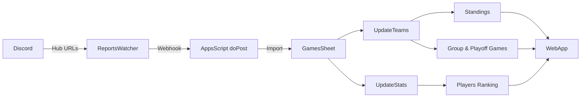
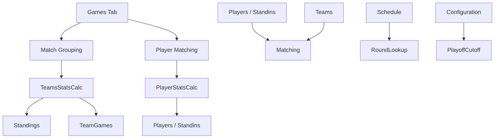
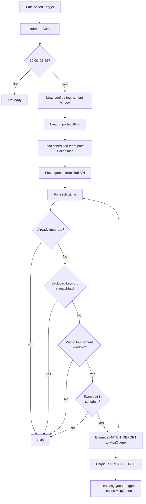

# 🏆 QWadmin - QuakeWorld tournament management tool (Google Sheets–Driven)

This project provides a **Google Sheets–based backend** for managing QuakeWorld tournaments, including:

- Admin UI to automate mundate tasks like schedule generation
- Automatic game imports from the QuakeWorld Hub
- Group-stage standings calculation
- Playoff separation
- Discord integration (both from and to)
- API-style backed Web frontend

Google Sheets acts as the **single source of truth**, with Apps Script providing the backend logic, admin UI and the Web App layer.

---

## How to use this (for beginners)

### Requirements

The only requirements are:
- a Google account
- a bit of focus and patience 😀
  
### Initial setup

Log in to your Google account, then create your own instance of QWadmin Google Sheet for the tournament you want to manage by navigating here:
  👉 https://docs.google.com/spreadsheets/d/1F0J3vrX2EySzALGfVQrfzDOqyT_wiDtY61LnWe_BAWE/copy

and clicking `Make a copy`. Rename the Sheet to clearly identify your tournament.

Then start by navigating to `Tournament Tools` -> `Open Control Panel` and following the instructions there.


Populate the following tabs as the miniumum viable setup:

- **Configuration**
- **Players**
- **Teams**
- **Schedule**
- **Discord** (if you want to use Discord integration which is recommeneded)

For a quick reference guide you can take a look at the QML6 Sheet used to run that tournament here:
  👉https://docs.google.com/spreadsheets/d/1UCnB9iNdJ_zKNIt_igMlRaN1Nxw4AyvM4juJ1hKXlDA/edit?usp=sharing

#### Tabs and their purpose

| Tab | Purpose | Additional info |
|---|---|---|
| **Configuration** | Main tournament configuration and its accompanied services | Backend, Discord + Web App and automation triggers maintenance |
| **Players / Standins** | List of players and their stats | `Game Nicks` is a comma-separated list of in-game `/name`(s) used to match a game record to a player. `Player` column is used for display-only purposes |
| **Teams** | List of teams | `Team Tag` must match the in-game `/team`. `Team Name` must match Schedule `Team1`/ `Team2` |
| **Schedule** | Tournament schedule | Used by backend, Discord tab, and Web App |
| **ScheduleConfig** | Schedule metadata | Maps, deadlines, etc. - generated from the Schedule tab |
| **Discord** | Discord posting tab & msg configuration / customisation | Edit column B only |
| **FIX-ME** | This tab will show any issues as a result of game data import with a guidance on how to fix them | |
| **WOTeamGames** | WO games record | Used to record walkovers |
| **ExcludedGames** | Games to be excluded from the stats calculation | Used to excluded imported games which shouldn't be part of the tournament |
| **DataImport** | Import queue / manual import functionality  | Used for importing game data by hand |
| **UnmatchedPlayers** | Unmatched game nicks | Diagnostic tab – **DO NOT EDIT DIRECTLY** |
| **UnmatchedTeamTags** | Unmatched team tags | Diagnostic tab – **DO NOT EDIT DIRECTLY** |
| **Standings** | Group-stage standings | **DO NOT EDIT** – generated automatically |
| **TeamGames** | All match results (group stage and playoffs) | Data tab - **DO NOT EDIT** |
| **Games** | Games database | Core game data tab – **DO NOT EDIT** unless fixing import issues|
| **ImportedURLs** | Deduplication list | Prevents duplicate imports |
| **PostHistory** | Discord message log | Auto-generated |
| **TEMPLATE-\*** | Helper templates | Not used directly |

> ⚠️ **IMPORTANT**  
> The **names of ALL tabs and column headings are critical**.  
> **DO NOT CHANGE THEM OR SHIT WILL BREAK!**

> ⚠️ **IMPORTANT**  
> Expected **date format** accross the board is: **dd/mm/yyyy**.  
> **DO NOT CHANGE IT OR SHIT WILL BREAK!**

The sheet itself provides a fully feldged tournament management system with the manual data import option in case automation and integrations are not required (see below).

### Posting to Discord

Posting weekly schedules to Discord is possible via the `Discord` tab. 
The tab contains a fully customisable message template and a few configuration options:

- Round - which round of the tournament it is - scheduling data is pulled from the `Schedule` tab based on the `Round` selected
- Playoff tree - link to a playoff bracket if not using the Web App otherwise left blank
- Discord web hook - **REQUIRED** - see 👉 https://www.google.com/search?q=how+to+setup+discord+hooks&ie=UTF-8 for instructions
- Web App deployment URL - your Web App deployment URL when using the Web App or simply this sheet's Google Sheet share link URL
- Everyone spam - whether to tag the Discord msg with @everyone or not
- Playoff msg - Playoff msg heading text
- Group stage msg - Group stage msg heading text
- Playoff match procedure - Playoff match procedure text
- Group match procedure - Group match procedure text
- Include players list - whether to include all players for each team in the Discord msg body
- Deadline msg - Deadline msg text
- Reporting prompt - Reporting prompt text (leave blank if not required)
- Team tags prompt - Team tags prompt text (leave blank if not required)
- Scheduling prompt - Scheduling prompt text (leave blank if not required)
- Ranking title - title for the `Web App deployment URL` link

### Manual data import

The sheet itself allows manual data imports from the QuakeWorld hub. In order to do so simply follow the instructions posted on the `DataImport` tab itself.

### Web App (simplified deployment method)

Each instance of the QWadmin comes with a simple display layer for the players.


You can check out the template example here: 👉 https://qw-app.short.gy/tHWsP7

To enable it follow the steps below:

- open your instance of QWadmin Google Sheet and navigate to `Extensions`->`Apps Script`
- on the `Apps Script` page click the blue `Deploy` button in the top right of the screen and select `New deployment`
- in `Select type` choose `Web app`. `Description` could be left blank. Leave `Execute as` on default. In `Who has access` - select `Anyone`. Then click `Deploy`
- on the next screen you will have to authorise the web app to access and modify your Google Sheets spreadsheet data (this spreadsheet only). Click `Authorise access` and in the `Google hasn’t verified this app` pop up click on `Advanced` then `Go to QWadmin (unsafe)`
- in the `QWadmin wants access to your Google Account` prompt tick `Select all` then click continue at the bottom. You'll receive a `Security alert` email from Google
- on the `New deployment` screen look for `Web app` section and click `Copy`. This URL schould look something like this: 'https://script.google.com/macros/s/...../exec'. Click `Done`
- within your QWadmin Google Sheet open the control panel by selecting `Tournament Tools` -> `Open Control Panel` from the Google Sheets main menu, then navigate to the `Configuration` tab paste the URL in `Web App deployment URL` configuration option. 


From now the link to the Web App will be posted as part of the weekly Discord schedule post.

## How to use this - advanced (using Automation via clasp)

Configure automation and integrations for a complete self-managing system:

- Deploy the **Apps Script code / Web frontend / API** using clasp (if not deployed using the Google Apps Script `Deploy` UI already - see above)

Web App exposes standings & schedule details, playoff bracket, played matches and player stats using `Web App deployment URL` configured & posted via `Discord` tab. 
Read below for deployment instructions using `clasp`.

- Deploy the **Reports Watcher Discord bot**  
 
Match reports are posted on Discord by the players. The Reports Watcher Discord bot extracts Hub URLs from the posts and sends to a Google Apps Script endpoint. Games are then imported automatically into the `Games` tab.
Successful processing is indicated by **bot reactions** on Discord messages.

See 👉 https://github.com/kindzal/qw-reports-watcher for deployment instructions.


---

## Architecture overview

### High-level system architecture


```mermaid
flowchart LR
  Discord -->|Hub URLs| ReportsWatcher
  ReportsWatcher -->|Webhook| AppsScript[AppsScript doPost]
  AppsScript -->|Import| GamesSheet
  GamesSheet --> UpdateStats
  GamesSheet --> UpdateTeams
  UpdateStats --> Ranking[Players Ranking]
  UpdateTeams --> Standings
  UpdateTeams --> TeamGames[Group & Playoff Games]
  Standings --> WebApp
  TeamGames --> WebApp
  Ranking --> WebApp
```

### Backend data flow (Apps Script)


```mermaid
flowchart TD
  Games[Games Tab]
  Players[Players / Standins]
  Teams[Teams]
  Schedule[Schedule]
  Config[Configuration]

  Games --> Match[Match Grouping]
  Games --> Ranking[Player Matching]
  Players --> Matching
  Teams --> Matching
  Schedule --> RoundLookup
  Config --> PlayoffCutoff

  Match --> TeamsStatsCalc
  Ranking --> PlayerStatsCalc
  TeamsStatsCalc --> Standings
  TeamsStatsCalc --> TeamGames[TeamGames]
  PlayerStatsCalc --> Rank[Players / Standins]
```

### autoImportGames flow


```mermaid
flowchart TD
  Trigger[Time-based Trigger] --> autoImportGames
  autoImportGames --> TimeCheck{19:00–23:59?}
  TimeCheck -- No --> Exit[Exit early]
  TimeCheck -- Yes --> LoadConfig[Load config / tournament window]
  LoadConfig --> LoadImported[Load ImportedURLs]
  LoadImported --> LoadSchedule[Load scheduled team pairs + alias map]
  LoadSchedule --> FetchHub[Fetch games from Hub API]
  FetchHub --> ForEach[For each game]
  ForEach --> AlreadyImported{Already imported?}
  AlreadyImported -- Yes --> Skip[Skip]
  AlreadyImported -- No --> ExcludedKeyword{Excluded keyword\nin matchtag?}
  ExcludedKeyword -- Yes --> Skip
  ExcludedKeyword -- No --> TournamentWindow{Within tournament\nwindow?}
  TournamentWindow -- No --> Skip
  TournamentWindow -- Yes --> ScheduledPair{Team pair in\nschedule?}
  ScheduledPair -- No --> Skip
  ScheduledPair -- Yes --> Enqueue[Enqueue MATCH_REPORT\nto MsgQueue]
  Enqueue --> ForEach
  Enqueue --> EnqueueStats[Enqueue UPDATE_STATS]
  EnqueueStats --> processMsgQueue[processMsgQueue trigger\nprocesses MsgQueue]
```

## Apps Script + Web App Deployment

This repository uses a **per-app deployment folder** and a **shared deployment workflow** built on top of **Google clasp** and **Short.io (for URL shortening)**.

The goal is to make deployments:
- repeatable
- explicit
- safe
- easy to run locally or in CI

---

### Folder Structure

Each Apps Script app follows this structure:

```
app-root/
├── deploy/
│   ├── deploy.bat
│   ├── Load-Env.ps1
│   ├── Deploy-App.ps1
│   ├── Deploy-AndUpdateLinkly.ps1   (legacy / fallback)
│   ├── Update-UrlShortener.ps1
│   ├── update-url-shortener.bat
│   ├── Update-Linkly.ps1   (legacy / fallback)
│   └── delete-deployments.ps1
│
├── src/
│   ├── Code.js
│   ├── admin.js
│   ├── admin.scripts.html
│   ├── admin.sidebar.html
│   ├── admin.styles.html
│   ├── admin.section.DataImport.html
│   ├── admin.section.Default.html
│   ├── admin.section.Discord.html
│   ├── admin.section.FIX-ME.html
│   ├── admin.section.Games.html
│   ├── admin.section.MapStats.html
│   ├── admin.section.MsgQueue.html
│   ├── admin.section.Players.html
│   ├── admin.section.READ-ME.html
│   ├── admin.section.Schedule.html
│   ├── admin.section.ScheduleConfig.html
│   ├── admin.section.Standings.html
│   ├── admin.section.Standins.html
│   ├── admin.section.TeamGames.html
│   ├── admin.section.Teams.html
│   ├── admin.section.UnmatchedPlayers.html
│   ├── admin.section.UnmatchedTeamTags.html
│   ├── admin.section.WOTeamGames.html
│   ├── api.js
│   ├── config.js
│   ├── discord.js
│   ├── fetchers.js
│   ├── getters.js
│   ├── globals.js
│   ├── helpers.js
│   ├── msgBus.js
│   ├── tests.js
│   ├── web.js
│   ├── index.html
│   ├── styles.html
│   └── appsscript.json
│
├── .clasp.json
└── .env
```

#### Admin UI layout and approach

The admin UI is a **Google Sheets sidebar** built as a single-page panel. It is composed of:

- **`admin.sidebar.html`** — the sidebar shell. Includes styles, scripts, and all section partials via Apps Script `<?!= include(...) ?>` templating. Renders the navigation and the loader overlay.
- **`admin.styles.html`** — all CSS for the sidebar UI.
- **`admin.scripts.html`** — all client-side JavaScript for the sidebar: tab switching, form submission, `google.script.run` calls, and general interactivity.
- **`admin.section.*.html`** — one file per sidebar tab/section (e.g. `admin.section.Schedule.html`, `admin.section.Teams.html`). Each contains the HTML markup for that panel only. The active section is shown/hidden via JavaScript — all sections are rendered into the DOM at load time.
- **`admin.js`** — server-side Apps Script functions called by the sidebar. Handles opening the sidebar (`openSidebar`), sheet switching, schedule generation, and any other admin-triggered backend operations.

---

### Source Files (`src/`)

| File | Purpose |
|-----|--------|
| `Code.js` | Core backend logic: game import pipeline, stats calculation, standings, match grouping, auto-import |
| `admin.js` | Server-side functions for the admin sidebar: schedule generation, sheet switching, overwrite confirmation |
| `admin.scripts.html` | Client-side JavaScript for the admin sidebar |
| `admin.sidebar.html` | Sidebar shell — includes all section partials, styles, and scripts |
| `admin.styles.html` | CSS for the admin sidebar UI |
| `admin.section.*.html` | One file per sidebar section/tab (e.g. Schedule, Teams, FIX-ME) |
| `api.js` | Backend API / request handling logic |
| `config.js` | Centralised configuration values |
| `discord.js` | Discord integration logic, including game reminders and unscheduled game alerts |
| `fetchers.js` | Hub API fetching logic used by the auto-import pipeline |
| `getters.js` | Sheet data accessor helpers |
| `globals.js` | Shared constants and global values |
| `helpers.js` | General utility / helper functions |
| `msgBus.js` | Message queue processor (`processMsgQueue`) — handles `MATCH_REPORT` and `UPDATE_STATS` messages |
| `tests.js` | Manual test / diagnostic functions |
| `web.js` | Web app routing / handlers |
| `index.html` | Main HTML UI for the web app |
| `styles.html` | NOT IN USE |
| `appsscript.json` | Apps Script manifest (scopes, runtime, services) |

All Apps Script `.js` and `.html` files are deployed via **clasp**.

---

### `.clasp.json`

Example:

```json
{
  "scriptId": "YOUR_GOOGLE_APPS_SCRIPT_ID",
  "rootDir": "src"
}
```

`rootDir` **must be `src`** because all Apps Script code lives there.

---

### `.env`

Example:

```env
# ----------------------------
# URL Shortener (provider-agnostic)
# ----------------------------
URL_SHORTENER_API_KEY=your_short_io_api_key
URL_SHORTENER_LINK_ID=your_short_link_id

# ----------------------------
# Linkly (kept for fallback)
# ----------------------------
LINKLY_API_KEY=your_linkly_api_key
LINKLY_WORKSPACE_ID=your_workspace_id
LINKLY_LINK_ID=your_link_id

# ----------------------------
# Optional
# ----------------------------
DEPLOYMENT_ID=AKfycbxxxxxxxxxxxxxxxx
```

> ⚠️ Never commit `.env` — add it to `.gitignore`.

---

### Deployment Flow (Important)

A correct deployment **always** follows this order:

1. **Push** code 
2. **Deploy** app
3. **Update short URL**

In clasp terms:

```
clasp push --force
clasp deploy
```

`clasp deploy` alone does **NOT** upload code.

---

### How to Deploy

From the **app root**:

```bat
deploy\deploy.bat
```

Or:

```bat
cd deploy
deploy.bat
```

#### What happens internally

1. `deploy.bat`
   - switches to the app root
   - launches PowerShell

2. `Load-Env.ps1`
   - loads variables from `.env` into the process environment

3. `Deploy-App.ps1`
   - runs `clasp push --force` (shows output)
   - runs `clasp deploy`
   - constructs the Web App URL from the deployment ID   
4. `Update-UrlShortener.ps1`
   - updates the short URL via API
---

> ⚠️ If URL shortener is not required navigate to `Apps Script` -> `Deploy` -> `Manage deployments`, select the current (first from the top) `Acitve` deployment, copy `Deployment IO` using the `Copy` button and insert it into your .env file.
> Using this method the web app URL stays the same.

### Deleting Deployments (Cleanup)

Google Apps Script / clasp allows only 20 active deployments hence the need to clean up old deployments.

#### Dry run (recommended)

```powershell
cd deploy
pwsh .\delete-deployments.ps1 -DryRun
```

#### Actual deletion

```powershell
cd deploy
pwsh .\delete-deployments.ps1
```

You must type:

```
DELETE
```

to confirm.

---

### Requirements

- Node.js
- `clasp` (`npm install -g @google/clasp`)
- PowerShell 5.1+ or PowerShell 7+
- Logged-in clasp account (`clasp login`)

---

### Summary

- Code lives in `src/`
- Config lives in app root
- Deployment logic lives in `deploy/`
- `clasp push --force` uploads code
- `clasp deploy` publishes it
- Short URL is updated automatically

This setup is designed to be **boring, explicit, and reliable** — exactly what deployment tooling should be.


## Technical documentation

This section describes how the backend works internally, how data flows through the system, and how derived data (standings, matches, playoffs) is calculated.

---

### Core concepts

#### Game
A **game** is a single map played on the QuakeWorld Hub.

Each game is represented by one or more rows in the **Games** tab (one row per player).

Key identifying attributes:
- URL
- Date
- Map
- Server
- Match Tag
- Map Won
- Frags
- Team (`/team`)
- Game Nick (`/name`)

---

#### Match

A **match** is a collection of games grouped by the system to represent a single head-to-head encounter between two teams.

Matches are derived automatically from the **Games** tab during stats calculation. Each match is identified by:

- **The two teams involved** (resolved from team tags via the alias map)
- **Date** (day part only)

Maps are grouped into a match when they share above attributes and fall within a configurable time window of each other (**240 minutes currently**).

Each match is written as a single row in the **TeamGames** tab with the following columns:

| Column | Description |
|---|---|
| `#` | Row number |
| `Stage` | `Group` or `Playoff` (determined by comparison against `Playoffs start date` in Configuration) |
| `Round` | Round label from the **Schedule** tab (e.g. `1`, `2`, `Quarterfinals`) |
| `TeamA` | Full team name |
| `MapsWonA` | Number of maps won by Team A |
| `Score` | Match score in `A-B` format |
| `TeamB` | Full team name |
| `MapsWonB` | Number of maps won by Team B |
| `AllMapsJSON` | JSON array of individual map results (see below) |
| `Date` | Match date |

Both group stage and playoff matches are stored in the single **TeamGames** tab, differentiated by the `Stage` column.

---

### Game import pipeline

1. Game URLs are received from:
   - Discord (via Reports Watcher bot → `doPost` webhook)
   - Manual entry in **DataImport**
   - Automatic polling of the Hub API via the `autoImportGames` time-based trigger, which filters games against tournament criteria (date window, scheduled team pairs, excluded keywords) and enqueues matching games without any manual intervention

2. Game data is fetched from the Hub and written to:
   - **Games** tab (one row per player per map)

3. Imported URLs are stored in:
   - **ImportedURLs** tab (deduplication)

4. `updateStats()` is executed to recompute all derived data

---

### Date handling and playoff separation

- Playoff cutoff is defined in **Configuration** using the key:
  `Playoffs start date`

- Group stage games:
  `gameDate < Playoffs start date`

- Playoff games:
  `gameDate >= Playoffs start date`

Date parsing supports:
- Google Sheets Date objects
- Strings in format: `YYYY-MM-DD HH:mm:ss +0000`

Dates are normalized before comparison to avoid timezone or parsing issues.

---

### Standings calculation (group stage only)

Standings are calculated **only from group-stage games**.

Aggregation rules:
- Map wins
- Map losses
- Game wins
- Game losses

Sorting order:
1. Games won (descending)
2. Map difference
3. Head-to-head result (group stage only)

Display columns remain unchanged.

---

### Head-to-head logic

When two teams are tied on:
- Games won
- Map difference

The system checks:
- Who won the internal group-stage match

Rules:
- Drawn matches are ignored
- Playoff matches are ignored
- Only group-stage games are considered

If no head-to-head result exists, ordering remains stable.

---

### TeamGames

Each row represents **one match**, not one map.

All matches — both group stage and playoff — are stored in the single **TeamGames** tab, differentiated by the `Stage` column (`Group` or `Playoff`).

Includes:
- Teams
- Maps won
- Match score
- Stage (`Group` / `Playoff`)
- Round (from Schedule)
- AllMapsJSON
- Date

---

### AllMapsJSON structure

Each match row contains a JSON array:

```json
[
  {
    "mapName": "dm2",
    "teamAFrags": 134,
    "teamBFrags": 121,
    "gameUrl": "https://hub.quakeworld.nu/...",
    "mapDate": "2025-01-12T20:34:00.000Z"
  }
]
```

Used for:
- API consumption
- Traceability back to the Hub
- Avoiding duplicated derived data

---

### Automation and triggers

| Trigger function | Type | Purpose |
|---|---|---|
| `processMsgQueue` | Time-based | Processes pending messages from the `MsgQueue` tab — handles `MATCH_REPORT` (game import) and `UPDATE_STATS` (stats recalculation) messages |
| `autoImportGames` | Time-based | Polls the QuakeWorld Hub API for games matching tournament criteria and enqueues new ones to `MsgQueue` automatically (runs between 19:00–23:59 only) |
| `sendTodayGameReminders` | Time-based | Posts Discord reminders for games scheduled to be played today |
| `sendUnscheduledGamesReminder` | Time-based | Posts a Discord reminder listing matches that have not yet been scheduled |
| `sendFixMeNotification` | Time-based | Posts a Discord msg to admins that they are some issues to be resolved |
| `doPost` | Webhook | Receives game URLs from the Reports Watcher Discord bot and enqueues them to `MsgQueue` |

---

### Known limitations

None currently known.

---

### Extensibility

The system can be extended by:
- Adding new config keys to **Configuration**
- Adding new derived sheets
- Exposing more data via the Web App

Core data in the **Games** tab should remain immutable whenever possible.

---

## Troubleshooting

The primary troubleshooting tool is the **Admin UI** sidebar (`Tournament Tools` → `Open Control Panel`).

The **FIX-ME** tab within the Admin UI surfaces any data issues detected during game import — such as unmatched players or team tags — along with guidance on how to resolve them. Always check this tab first when something looks wrong.

## Related repositories

- Reports Watcher (Discord bot): https://github.com/kindzal/qw-reports-watcher
