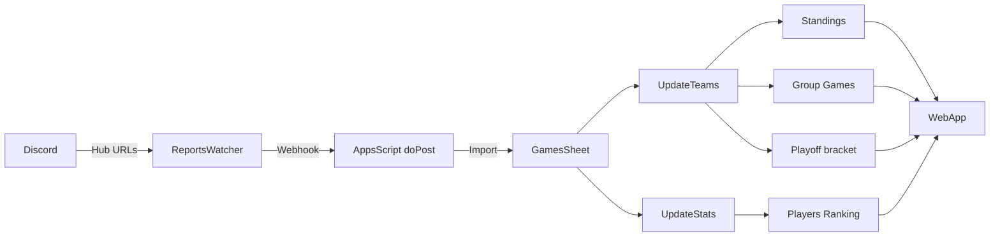
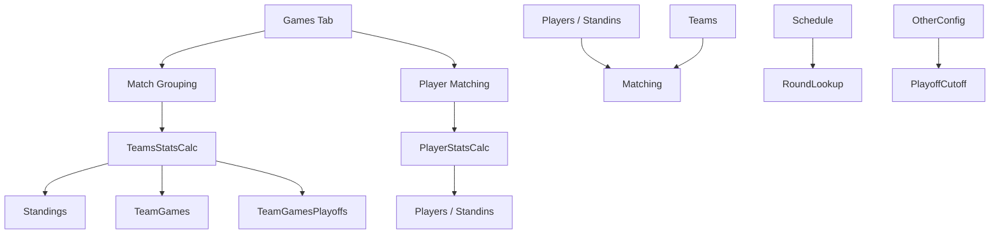

# 🏆 QuakeWorld Tournament Management (Google Sheets–Driven)

This project provides a **Google Sheets–based backend** for managing QuakeWorld tournaments, including:

- Automatic game imports from the QuakeWorld Hub
- Group-stage standings calculation
- Playoff separation
- Discord integration
- API-backed Web frontend

Google Sheets acts as the **single source of truth**, with Apps Script providing the backend logic.

---

## How to use this

### Initial setup

Firstly download a template and populate the following tabs:

- **Players / Standins**
- **Teams**
- **Schedule**
- **ScheduleConfig**
- **OtherConfig**

Then configure automation and integrations:

- Deploy the **Apps Script code / Web frontend / API**    
- (Optional) Deploy the **Reports Watcher Discord bot**  
  👉 https://github.com/kindzal/qw-reports-watcher


> ⚠️ **IMPORTANT**  
> The **names of ALL tabs and column headings are critical**.  
> **DO NOT CHANGE THEM OR SHIT WILL BREAK!**

---

### Discord auto-importing

- Match reports are posted on Discord by the players
- The Reports Watcher Discord bot extracts Hub URLs from the posts
- URLs are sent to a Google Apps Script endpoint
- Games are imported automatically into the `Games` tab

Successful processing is indicated by **bot reactions** on Discord messages.

---

### Optional features

- Posting weekly schedules to Discord via the **Discord** tab
- Exposing standings, matches, and stats via the Web App

Each feature has **its own configuration** in the relevant tab.

---

## Tabs and their purpose

| Tab | Purpose | Additional info |
|---|---|---|
| **Players / Standins** | List of players | `Game Nicks` is a comma-separated list of in-game `/name`s used to match game records. `Player` is display-only. |
| **Teams** | List of teams | `Team Tag` must match the in-game `/team`. `Team Name` must match Schedule `Team1`/ `Team2`. |
| **Standings** | Group-stage standings | **DO NOT EDIT** – generated automatically |
| **DataImport** | Import queue / manual import functionality  | Only edit yellow rows if mannually importing |
| **UnmatchedPlayers** | Unmatched game nicks | Diagnostic tab – **DO NOT EDIT** |
| **TeamGames** | Group-stage match results | **DO NOT EDIT** |
| **TeamGamesPlayoffs** | Playoff match results | Split using `Playoffs start date` |
| **Discord** | Discord posting tab & msg configuration / customisation | Edit column B only |
| **Schedule** | Tournament schedule | Used by backend, Discord tab, and Web App |
| **ScheduleConfig** | Schedule metadata | Maps, deadlines, etc. |
| **OtherConfig** | Global config | Backend + Web App |
| **Games** | Games database | Core dataset – **DO NOT EDIT** |
| **ImportedURLs** | Deduplication list | Prevents duplicate imports |
| **PostHistory** | Discord message log | Auto-generated |
| **TEMPLATE-\*** | Helper templates | Not used directly |

---

## Architecture overview

### High-level system architecture



### Backend data flow (Apps Script)



## Apps Script + Web App Deployment

This repository uses a **per-app deployment folder** and a **shared deployment workflow** built on top of **Google clasp** and **Linkly**.

The goal is to make deployments:
- repeatable
- explicit
- safe
- easy to run locally or in CI

---

### Folder Structure

Each Apps Script app follows this structure:

```
app-root/
├── deploy/
│   ├── deploy.bat
│   ├── Load-Env.ps1
│   ├── Deploy-AndUpdateLinkly.ps1
│   ├── delete-deployments.ps1
│   └── (optional helper scripts)
│
├── src/
│   ├── api.js
│   ├── Code.js
│   ├── config.js
│   ├── discord.js
│   ├── web.js
│   ├── index.html
│   ├── styles.html
│   └── appsscript.json
│
├── .clasp.json
└── .env
```

---

### Source Files (`src/`)

| File | Purpose |
|-----|--------|
| `api.js` | Backend API / request handling logic |
| `Code.js` | Main Apps Script entry point and orchestration |
| `config.js` | Centralised configuration values |
| `discord.js` | Discord integration logic |
| `web.js` | Web app routing / handlers |
| `index.html` | Main HTML UI for the web app |
| `styles.html` | NOT IN USE |
| `appsscript.json` | Apps Script manifest (scopes, runtime, services) |

All Apps Script `.js` and `.html` files are deployed via **clasp**.

---

### `.clasp.json`

Example:

```json
{
  "scriptId": "YOUR_GOOGLE_APPS_SCRIPT_ID",
  "rootDir": "src"
}
```

`rootDir` **must be `src`** because all Apps Script code lives there.

---

### `.env`

Example:

```env
LINKLY_API_KEY=your_api_key
LINKLY_WORKSPACE_ID=your_workspace_id
LINKLY_LINK_ID=your_link_id

# Optional (recommended)
DEPLOYMENT_ID=AKfycbxxxxxxxxxxxxxxxx
```

> ⚠️ Never commit `.env` — add it to `.gitignore`.

---

### Deployment Flow (Important)

A correct deployment **always** follows this order:

1. **Push** code 
2. **Deploy** app
3. **Update Linkly**

In clasp terms:

```
clasp push --force
clasp deploy
```

`clasp deploy` alone does **NOT** upload code.

---

### How to Deploy

From the **app root**:

```bat
deploy\deploy.bat
```

Or:

```bat
cd deploy
deploy.bat
```

#### What happens internally

1. `deploy.bat`
   - switches to the app root
   - launches PowerShell

2. `Load-Env.ps1`
   - loads variables from `.env` into the process environment

3. `Deploy-AndUpdateLinkly.ps1`
   - runs `clasp push --force` (shows output)
   - runs `clasp deploy`
   - constructs the Web App URL from the deployment ID
   - updates the Linkly link via their API

---

### Deleting Deployments (Cleanup)

Google Apps Script / clasp allows only 20 active deployments hence the need to clean up old deployments.

#### Dry run (recommended)

```powershell
cd deploy
pwsh .\delete-deployments.ps1 -DryRun
```

#### Actual deletion

```powershell
cd deploy
pwsh .\delete-deployments.ps1
```

You must type:

```
DELETE
```

to confirm.

---

### Requirements

- Node.js
- `clasp` (`npm install -g @google/clasp`)
- PowerShell 5.1+ or PowerShell 7+
- Logged-in clasp account (`clasp login`)

---

### Summary

- Code lives in `src/`
- Config lives in app root
- Deployment logic lives in `deploy/`
- `clasp push --force` uploads code
- `clasp deploy` publishes it
- Linkly is updated automatically

This setup is designed to be **boring, explicit, and reliable** — exactly what deployment tooling should be.


## Technical documentation

This section describes how the backend works internally, how data flows through the system, and how derived data (standings, matches, playoffs) is calculated.

---

### Core concepts

#### Game
A **game** is a single map played on the QuakeWorld Hub.

Each game is represented by one or more rows in the **Games** tab (one row per player).

Key identifying attributes:
- URL
- Date
- Map
- Server
- Match Tag
- Map Won
- Frags
- Team (`/team`)
- Game Nick (`/name`)

---

#### Match
A **match** is a collection of games that share all of the following:

- **Date** (day part only)
- **Server**
- **Match Tag**

These three fields are used to group multiple maps into a single match.

Limitation:
If any of these values differ between games (e.g. server change, match tag change, match crosses midnight), the system will treat them as separate matches.

---

### Game import pipeline

1. Game URLs are received from:
   - Discord (via Reports Watcher bot)
   - Manual entry in **DataImport**

2. Game data is fetched from the Hub and written to:
   - **Games** tab (one row per player per map)

3. Imported URLs are stored in:
   - **ImportedURLs** tab (deduplication)

4. `updateStats()` is executed to recompute all derived data

---

### Date handling and playoff separation

- Playoff cutoff is defined in **OtherConfig** using the key:
  `Playoffs start date`

- Group stage games:
  `gameDate < Playoffs start date`

- Playoff games:
  `gameDate >= Playoffs start date`

Date parsing supports:
- Google Sheets Date objects
- Strings in format: `YYYY-MM-DD HH:mm:ss +0000`

Dates are normalized before comparison to avoid timezone or parsing issues.

---

### Standings calculation (group stage only)

Standings are calculated **only from group-stage games**.

Aggregation rules:
- Map wins
- Map losses
- Game wins
- Game losses

Sorting order:
1. Games won (descending)
2. Map difference
3. Head-to-head result (group stage only)

Display columns remain unchanged.

---

### Head-to-head logic

When two teams are tied on:
- Games won
- Map difference

The system checks:
- Who won the internal group-stage match

Rules:
- Drawn matches are ignored
- Playoff matches are ignored
- Only group-stage games are considered

If no head-to-head result exists, ordering remains stable.

---

### TeamGames and TeamGamesPlayoffs

Each row represents **one match**, not one map.

Includes:
- Teams
- Maps won
- Match score
- Round (from Schedule)
- AllMapsJSON

---

### AllMapsJSON structure

Each match row contains a JSON array:

```json
[
  {
    "mapName": "dm2",
    "teamAFrags": 134,
    "teamBFrags": 121,
    "gameUrl": "https://hub.quakeworld.nu/..."
  }
]
```

Used for:
- API consumption
- Traceability back to the Hub
- Avoiding duplicated derived data

---

### Automation and triggers

- Time-based trigger: processes pending imports (`processPendingReports` backend function)
- Webhook trigger: receives Discord bot payloads
- Manual execution: admin-triggered import / recalculation

---

### Known limitations

- Relies on consistent team tags
- Matches crossing midnight require manual correction
- Server changes mid-match cause match splitting
- Multi-team tie resolution beyond head-to-head is not implemented

---

### Extensibility

The system can be extended by:
- Adding new config keys to **OtherConfig**
- Adding new derived sheets
- Exposing more data via the Web App

Core data in the **Games** tab should remain immutable whenever possible.

---

## Troubleshooting

This section lists common issues, their likely causes, and how to resolve them.

---

### Backend / Apps Script issues

| Symptom | Likely issue | Solution |
|------|------------|---------|
| **Exception: The number of rows in the range must be at least 1** | No stand-in records exist | Add a dummy record to the **Standins** tab (e.g. `standin, standin, standin`) |
| **Stats not updating after imports** | Trigger not running | Check time-based trigger is configured to run `processPendingReports()` |
| **Games appear but standings are empty** | All games treated as playoffs | Check **Playoffs start date** in `OtherConfig` (format must be `DD/MM/YYYY`) |
| **Playoff games appear in Standings** | Date parsing failed | Ensure `Games → Date` column contains valid dates or ISO-style timestamps |
| **Group-stage games appear in Playoffs sheet** | Incorrect cutoff date | Verify `OtherConfig → Playoffs start date` |

---

### Player / team matching issues

| Symptom | Likely issue | Solution |
|------|------------|---------|
| **UnmatchedPlayers tab not empty** | Game nick not mapped | Add missing nick to **Players / Standins → Game Nicks** |
| **Player stats incorrect** | Nick mismatch or typo | Fix nick and re-run `DataImport → Update Stats` |
| **Team shown as tag instead of name** | Team Tag mismatch | Ensure `Teams → Team Tag` matches `Games → Team` |
| **Same team appears under multiple names** | Inconsistent tags used | Normalize tags in the `Games` tab |

---

### Match grouping issues

| Symptom | Likely issue | Solution |
|------|------------|---------|
| **Single match split into multiple entries** | Server, match tag, or date differs | Normalize these fields in the `Games` tab |
| **Maps in wrong order** | Incorrect or inconsistent dates | Ensure `Games → Date` is consistent |
| **Head-to-head ordering incorrect** | Drawn match or missing data | Verify both teams played a group-stage match |

A match is defined strictly by:
- Date (day only)
- Server
- Match Tag

---

### Discord / importing issues

| Symptom | Likely issue | Solution |
|------|------------|---------|
| **URLs stuck in DataImport** | Import not running | Check trigger and Reports Watcher bot |
| **Discord bot reacts with error** | Invalid or duplicate URL | Verify Hub link |
| **Bot reacts but no import occurs** | Endpoint error | Check Apps Script Web App deployment |

---

### Web App issues

| Symptom | Likely issue | Solution |
|------|------------|---------|
| **Incorrect standings on Web UI** | Backend not updated | Trigger stats update |
| **Match duplicated** | Grouping issue | Normalize server/tag/date |
| **Missing maps** | Incomplete import | Re-import Hub URLs |

---

### Data repair guidance

Safe to edit:
- `DataImport` (yellow rows only when triggering a manual import)
- `Players / Standins`
- `Teams`
- `Schedule`
- `ScheduleConfig`
- `OtherConfig`
- `Discord` (column B only) to configure Web App url and webhook and/or to customise the message )

Avoid editing unless fixing broken imports:
- `Games`
- `ImportedURLs`

Always re-run `DataImport → Update Stats` after manual fixes.

---

### Logging & debugging tips

- Check **Apps Script → Executions**
- Use `Logger.log()` for debugging
- Monitor `UnmatchedPlayers`
- Verify `Playoffs start date` after sheet copies

---

## Related repositories

- Reports Watcher (Discord bot): https://github.com/kindzal/qw-reports-watcher